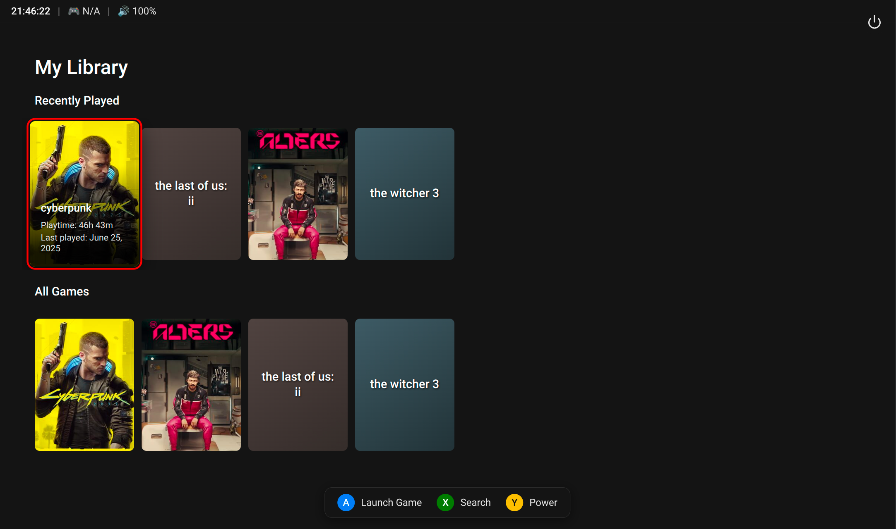
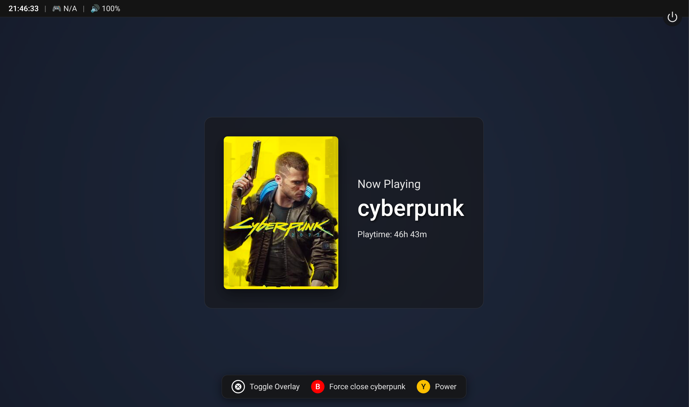

# Application Screenshots

Here are some screenshots showcasing the Lutris Gamepad UI in action.

---

### Game Library View

This is the main screen where you can browse your game library using a gamepad. The shelves are automatically generated, with "Recently Played" at the top for quick access.

---

### Now Playing View

When a game is launched, this "Now Playing" screen is displayed. It provides a clean, focused view and allows you to force-close the game if needed.

